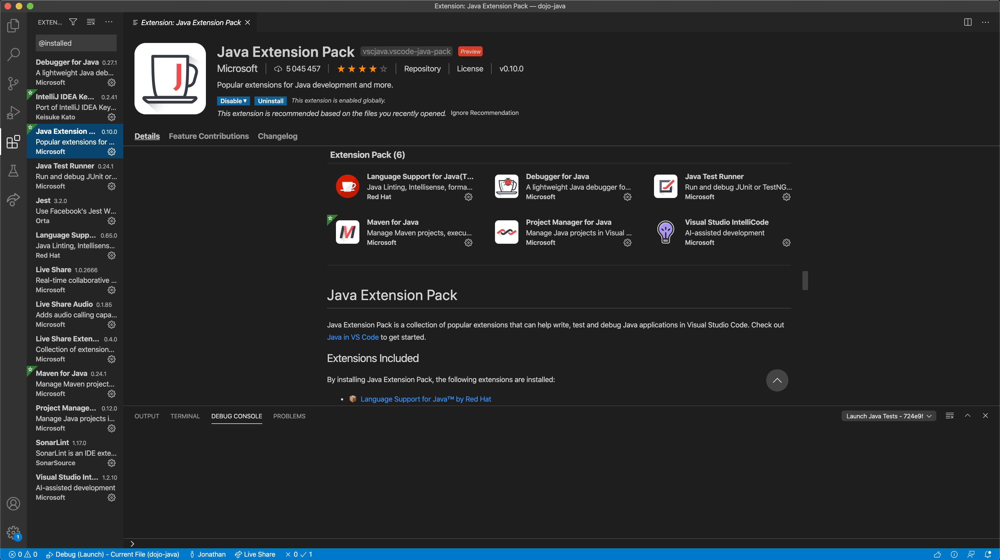
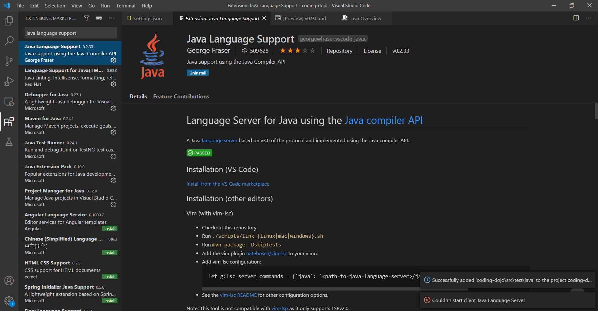
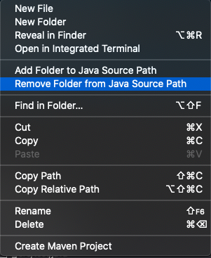
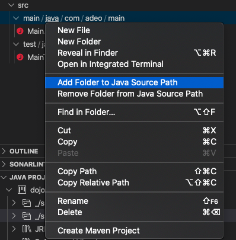
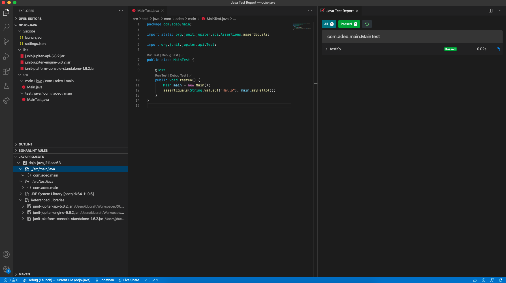
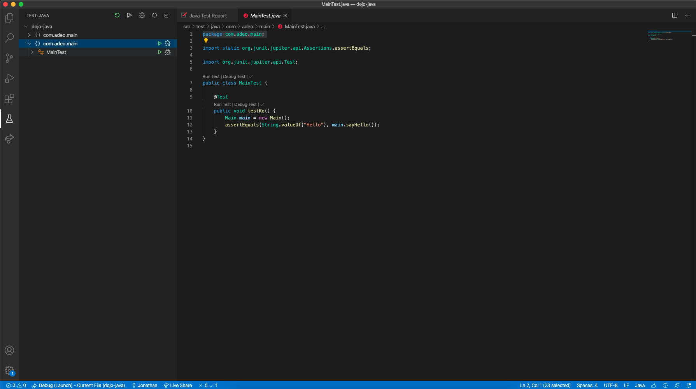

# Boot your `Java` stack

When practicing the code you don't have to bother with framework. Here are a few steps to help you install a minimalist Java Stack to start coding right away.

Don't hesitate to practice booting a project because `Code Wins Arguments` so when you need to prove something you can code it fast (and with tests!).

## Summary
- [JDK](#jdk)
- [VSCode](#vscode)
- [JUnit 5](#junit-5)
    - [Dependencies](#dependencies)
    - [Introduction](#introduction)
- [VSCode Settings](#vscode-settings)
    - [Scan for dependencies](#scan-for-dependencies)
    - [Check your Java Source Path](#check-your-java-source-path)
- [First Test](#first-test)

## JDK
- Install [Open JDK](https://adoptopenjdk.net/installation.html) (Aim at least for version 11)
- Check your installation
```bash
▶ echo $JAVA_HOME
/Users/jducraft/.jenv/versions/openjdk64-11.0.6

▶ java -version
openjdk version "11.0.6" 2020-01-14
OpenJDK Runtime Environment AdoptOpenJDK (build 11.0.6+10)
OpenJDK 64-Bit Server VM AdoptOpenJDK (build 11.0.6+10, mixed mode)
```

If you are using brew on MacOS, you can check your version
```bash
▶ brew cask info java
```

## VSCode

- Install [VSCode](https://code.visualstudio.com/)
- Check your installation (or start the application)
```bash
▶ code --version
1.48.0
```
- Install [Java Extension Pack](https://marketplace.visualstudio.com/items?itemName=vscjava.vscode-java-pack) plugin



- Install [Java Language Support](https://marketplace.visualstudio.com/items?itemName=georgewfraser.vscode-javac) plugin



## JUnit 5

### Introduction
JUnit 5 is built around 3 dependencies to help migrate from JUnit 4:
- JUnit Platform: supports API for both JUnit 4 & 5
- JUnit Jupiter: JUnit 5
- JUnit Vintage: Junit 4

We will only use JUnit 5 so you need to download those jars:
- [junit-jupiter-api-5.6.2.jar](https://repo1.maven.org/maven2/org/junit/jupiter/junit-jupiter-api/5.6.2/junit-jupiter-api-5.6.2.jar) (150 KB) : The API to write tests using JUnit 5 only
- [junit-jupiter-engine-5.6.2.jar](https://repo1.maven.org/maven2/org/junit/jupiter/junit-jupiter-engine/5.6.2/junit-jupiter-engine-5.6.2.jar) : The engine to run JUnit 5 tests only
- [junit-platform-console-standalone-1.6.2.jar](https://repo1.maven.org/maven2/org/junit/platform/junit-platform-console-standalone/1.6.2/junit-platform-console-standalone-1.6.2.jar) :  Lets you launch the JUnit Platform from the console (mandatory for VSCode).

### Dependencies
Download the jars for JUnit and put them in your project directory:
```
-- my-dojo-directory
    -- libs
        -- junit-jupiter-api-5.6.2.jar
        -- junit-jupiter-engine-5.6.2.jar
        -- junit-platform-console-standalone-1.6.2.jar
```

## VSCode Settings

### Scan for dependencies

Add a local `settings.json` file to you `.vscode` directory to configure the dependencies manualy.
```json
{
     "java.project.referencedLibraries": ["libs/**/*.jar"]
}
```

You should have something like this:
```
-- my-dojo-directory
    -- .vscode
        -- settings.json
    -- libs
        -- junit-jupiter-api-5.6.2.jar
        -- junit-jupiter-engine-5.6.2.jar
        -- junit-platform-console-standalone-1.6.2.jar
```

## Add some code

Now you are almost ready to run you first test, so create a file in you project directory:
```
-- my-dojo-directory
    -- .vscode
        -- settings.json
    -- libs
        -- junit-jupiter-api-5.6.2.jar
        -- junit-jupiter-engine-5.6.2.jar
        -- junit-platform-console-standalone-1.6.2.jar
    - src
        -- main
            -- java
        -- test
            -- java
```

If you want to create a package you have to create the directories to it first.
```
-- my-dojo-directory
    -- .vscode
        -- settings.json
    -- libs
        -- junit-jupiter-api-5.6.2.jar
        -- junit-jupiter-engine-5.6.2.jar
        -- junit-platform-console-standalone-1.6.2.jar
    - src
        -- main
            -- java
                -- com
                    -- adeo
                        -- main
        -- test
            -- java
                -- com
                    -- adeo
                        -- main
```

Then you can create a file `MainTest.java` in `test/java/com/main`

```java
package com.adeo.main;

import static org.junit.jupiter.api.Assertions.assertTrue;

import org.junit.jupiter.api.Test;

public class MainTest {

    @Test
    public void testKo() {
        assertTrue(false);
    }
}
```

### Check your Java Source Path

It is important to have your Source Paths aligned with you packages

For example if you have this kind of directory:
```
-- my-dojo-directory
    -- .vscode
        -- settings.json
    -- libs
        -- junit-jupiter-api-5.6.2.jar
        -- junit-jupiter-engine-5.6.2.jar
        -- junit-platform-console-standalone-1.6.2.jar
    -- src/test/java/com/adeo/main
    -- src/main/java/com/adeo/main
```

and you want your package names to be `com.adeo.main`, you have to both `src/test/java` and `src/main/java` to your source path.

You can't add a directory to the Java Source Path if a parent is already in it, so the first step is to remove any parent from the source path.

In VSCode, right click on the parent directory `src` and click on `Remove Folder from Java Source Path`.



Then to add the needed directories to Java Source Path right click on the directory (`src/test/java`, `src/main/java`) and click on `Add Folder to Java Source Path`.



You can check that everything is working fine in the `Java Projects` tab.



### Running

To run the test you can go to the test tab and run it from there



Congratulations! you created your stack and stayed fully in control!
