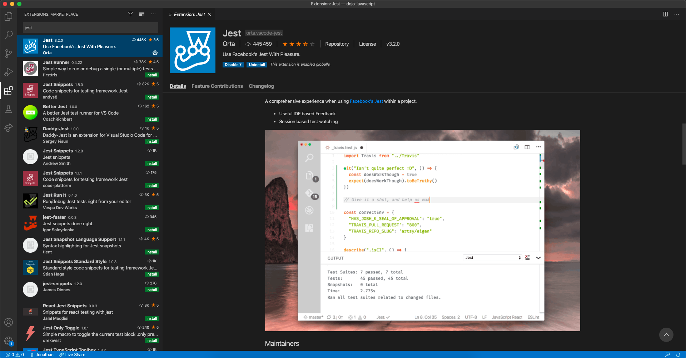
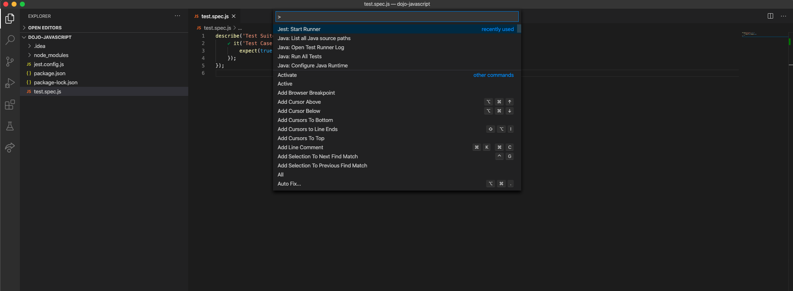

# Boot your `Javascript` stack

When practicing the code you don't have to bother with framework. Here
are a few steps to help you install a minimalist Javascript Stack to start coding right away.

Don't hesitate to practice booting a project because `Code Wins Arguments` so when you need to prove something you can code it fast (and with tests!).

## SUMMARY
- [Node](#jdk)
- [VSCode](#vscode)
- [Initialize NPM project](#initialize-npm-project)
- [Jest](#jest)
- [First Test](#first-test)

## JDK
- Install [NodeJS](https://nodejs.org/en/) (Aim at least for version 12)
- Check your installation
```bash
▶ node --version
v12.18.3
```

## VSCode

- Install [VSCode](https://code.visualstudio.com/)
- Check your installation (or start the application)
```bash
▶ code --version
1.48.0
```

## Initialize NPM project

```bash
▶ npm init
This utility will walk you through creating a `package.json` file.
It only covers the most common items, and tries to guess sensible defaults.

See `npm help init` for definitive documentation on these fields
and exactly what they do.

Use `npm install <pkg>` afterwards to install a package and
save it as a dependency in the package.json file.
```

## Jest

- Install [Jest](https://marketplace.visualstudio.com/items?itemName=Orta.vscode-jest) plugin for VSCode



### Install Jest Dependency
```bash
▶ npm i -D jest
```

### Initialize Jest Configuration

Use `npx` to create a jest configuration file.

```bash
▶ npx jest --init
npx : 507 installé(s) en 12.101s

The following questions will help Jest to create a suitable configuration for your project

✔ Would you like to use Jest when running "test" script in "package.json"? … yes
✔ Choose the test environment that will be used for testing › node
✔ Do you want Jest to add coverage reports? … no
✔ Which provider should be used to instrument code for coverage? › v8
✔ Automatically clear mock calls and instances between every test? … no

✏️  Modified /Users/jducraft/Workspace/ADEO/dojo-javascript/package.json

📝  Configuration file created at /Users/jducraft/Workspace/ADEO/dojo-javascript/jest.config.js
```

### Set Jest Matching patterns
In the `jest.config.js` look for the configuration of the test matchers and choose you own!
```json
{
...
  // The glob patterns Jest uses to detect test files
   testMatch: [
     "**/*.spec.js"
   ],
...
}
``` 

## First Test

Now you are ready to run you first test, so create a file in you project directory:
```
-- my-dojo-directory
    -- .vscode
    -- src
        -- mytest.spec.js
    -- jest.config.js
```

Add the following code to create a failing test:

```javascript
describe('Test Suite', () => {
    it('Test Case', () => {
        expect(false).toEqual(true);
    });
});
```

Run the test you can use npm test:

```bash
▶ npm test

> dojo-javascript@1.0.0 test /Users/jducraft/Workspace/ADEO/dojo-javascript
> jest

 FAIL  ./test.spec.js
  Test Suite
    ✕ Test Case (4 ms)

  ● Test Suite › Test Case

    expect(received).toEqual(expected) // deep equality

    Expected: true
    Received: false

      1 | describe('Test Suite', () => {
      2 |     it('Test Case', () => {
    > 3 |         expect(false).toEqual(true);
        |                       ^
      4 |     });
      5 | });
      6 |

      at Object.<anonymous> (test.spec.js:3:23)

Test Suites: 1 failed, 1 total
Tests:       1 failed, 1 total
Snapshots:   0 total
Time:        0.42 s, estimated 1 s
Ran all test suites.
npm ERR! Test failed.  See above for more details.
```

You can run it from VSCode by running the command `Jest Start Runner`, you will see a red `dot` or a green `tick` next to the test case.
The test will run `on save`.



Congratulations! you created your stack and stayed fully in control!
